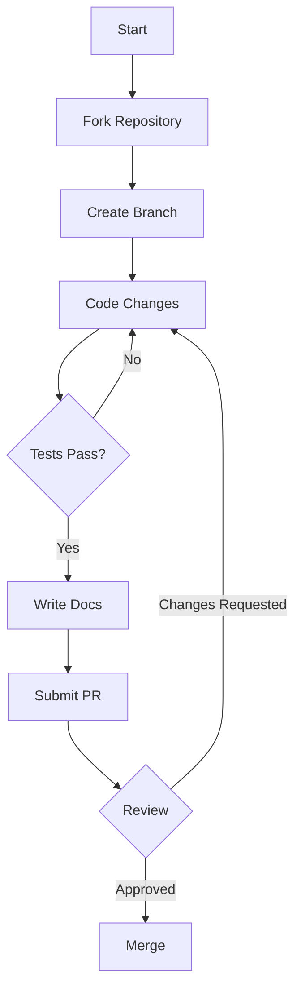

# Contributing to Math Explorer

First off, thank you for considering contributing to Math Explorer! It's people like you that make this tool such a great resource.

##  The "Golden Rule" of Contribution

**"Code explains HOW; Docs explain WHY."**

When you submit a PR, you aren't just merging code; you are merging knowledge. Ensure your contributions are accessible to others.

##  Getting Started

1.  **Fork the repository** on GitHub.
2.  **Clone your fork** locally:
    ```bash
    git clone https://github.com/fderuiter/math-explorer.git
    cd math-explorer
    ```
3.  **Create a branch** for your feature or fix:
    ```bash
    git checkout -b feature/amazing-new-math
    ```

##  Workflow



## Git Hooks & Guardrails

To ensure immediate feedback and high integrity, standards (such as file-length limits in core directories) are enforced automatically at the commit level. Running the project setup command (`cargo run -p xtask -- setup`) automatically configures a Git pre-commit hook that runs the centralized verification suite. This minimizes CI failures and maintains architectural constraints.

##  Testing

We take reliability seriously. Before submitting, ensure all tests pass.

```bash
# Run tests for the core library
cargo test --package math_explorer

# Run checks for the GUI (if applicable)
cargo check --package math_explorer_gui
```

If you add new functionality, **you must add tests**.
- **Unit Tests**: Place them in the same file as the code, in a `mod tests` module.
- **Integration Tests**: Place them in the `tests/` directory.

##  Contributing to the GUI

The `math_explorer_gui` crate is built with **egui** and **eframe**.

*   **Structure:**
    *   UI code resides in `math_explorer_gui/src`.
    *   The GUI should primarily visualize and control logic defined in the core `math_explorer` library. Avoid implementing heavy mathematical logic directly in the GUI crate.
*   **Dependencies:** We maintain strict version compatibility between `egui`, `eframe`, and `egui_plot`. Check `Cargo.toml` before updating dependencies.

##  Documentation Style Guide

We follow the **Curator's Philosophy**: "Code explains HOW; Docs explain WHY."

*   **Public API**: Every new or updated public struct, enum, trait, and function must have a docstring (`///`). Our automated integration checks will fail if you submit undocumented public APIs.
*   **Legacy Exemptions**: To prevent delaying ongoing work, older undocumented modules are grandfathered in. If you are touching a legacy module that has no documentation, you may leave it exempt. Existing exemptions are declared at the module level using `#[allow(missing_docs)]`. **Do not** add crate-level exemptions (e.g., `#![allow(missing_docs)]` in `lib.rs`), as any new files must be properly documented.
*   **Examples**: Include runnable examples in your docstrings using generic code blocks or doctests.
*   **Clarity**: Avoid fluff words ("simple", "easy"). Be precise.
*   **Mental Compilation**: Ensure your examples are syntactically correct and import necessary dependencies.
*   **Update the "Front Door"**: If you touch a core feature, update the `README.md` summary to reflect it.

Example:

```rust,ignore
/// Checks if a number is a prime number.
///
/// # Arguments
///
/// * `n` - The number to check.
///
/// # Returns
///
/// `true` if `n` is prime, `false` otherwise.
///
/// # Example
///
/// ```
/// use math_explorer::pure_math::number_theory::is_prime;
/// assert!(is_prime(5));
/// assert!(!is_prime(4));
/// ```text
pub fn is_prime(n: u64) -> bool { ... }
```

##  Submission Process

1.  **Commit your changes** with a descriptive message.
2.  **Push to your branch**.
3.  **Open a Pull Request**.
4.  **Wait for review**. We might ask for changes to code or documentation.

###  Documentation Checklist

Before marking your PR as ready, ensure you have:

- [ ] Added docstrings to all new public items.
- [ ] Included a runnable example for complex logic.
- [ ] Verified that `cargo test --doc` passes.
- [ ] Updated `README.md` if you added a new module or feature.
- [ ] Checked for broken links or typos.

Thank you for helping us fight Knowledge Rot!

## Architectural Decision Records (ADRs)

Before making significant structural changes, please review our existing architectural decisions. For example, our approach to workspace design is detailed in the [Dynamic Workspace Discovery](docs/adr/0001-dynamic-workspace-discovery.md) ADR, and our documentation verification mechanism is outlined in the [Unified LaTeX Linter](docs/adr/0006-unified-latex-linter.md) ADR.

## Critical Safety & Quality Standards (The NASA Power of 10)

To ensure reliability and verifiability, we adopt an adaptation of NASA's "Power of 10" rules for this codebase. Adherence to these rules is mandatory for core logic.

1.  **Simple Control Flow**:
    *   **Rule**: Restrict code to very simple control flow constructs.
    *   **Implementation**: Do not use recursion; use iterative solutions. Avoid complex `break`/`continue` logic where a simple iterator would suffice. No `goto` (obviously).

2.  **Fixed Loop Bounds**:
    *   **Rule**: All loops must have fixed upper bounds.
    *   **Implementation**: Ensure iterators are finite. When using `while` loops, include a safety counter to prevent infinite execution (e.g., `let mut safety = 0; while condition && safety < MAX_ITER { ... safety += 1; }`).

3.  **No Dynamic Memory Allocation (Post-Init)**:
    *   **Rule**: Do not use dynamic memory allocation after initialization.
    *   **Implementation**: Minimize dynamic allocation during the core simulation loop. Pre-allocate `Vec` capacities (`Vec::with_capacity`). Avoid creating new heap-allocated structures inside hot loops.

4.  **Limit Function Length**:
    *   **Rule**: No function should be longer than what can be printed on a single sheet of paper (approx. 60 lines).
    *   **Implementation**: Decompose large functions into smaller, testable helper functions. If a function is too long, it likely violates the Single Responsibility Principle.

5.  **Assertion Density**:
    *   **Rule**: The assertion density of the code should average to a minimum of two assertions per function.
    *   **Implementation**: Use `assert!` to enforce invariants (e.g., "mass must be positive") and `debug_assert!` for performance-critical checks. Validate function inputs and state consistency rigorously.

6.  **Small Data Scope**:
    *   **Rule**: Data objects must be declared at the smallest possible level of scope.
    *   **Implementation**: Avoid `static` or global state. Variables should be local to their usage block. Pass data explicitly via arguments rather than relying on shared mutable state.

7.  **Check Return Values**:
    *   **Rule**: The return value of non-void functions must be checked by each calling function.
    *   **Implementation**: **Never ignore `Result`**. Use `?` propagation or handle errors explicitly. Do not use `let _ = ...` to suppress errors. Compiler warnings about unused results must be resolved.

8.  **Limited Preprocessor Use**:
    *   **Rule**: The use of the preprocessor must be limited.
    *   **Implementation**: Avoid complex macros and conditional compilation (`#[cfg]`) inside function bodies. Use generic traits and polymorphism instead of macros where possible.

9.  **Restricted Pointer Use**:
    *   **Rule**: The use of pointers should be restricted.
    *   **Implementation**: Avoid `unsafe` blocks and raw pointers unless absolutely necessary for FFI or performance (with rigorous justification). Prefer safe references and smart pointers (`Box`, `Rc`, `Arc`).

10. **Compile with All Warnings**:
    *   **Rule**: All code must be compiled with all compiler warnings enabled.
    *   **Implementation**: Treat warnings as errors. Run `cargo clippy -- -D warnings` regularly. Zero tolerance for compiler warnings.
