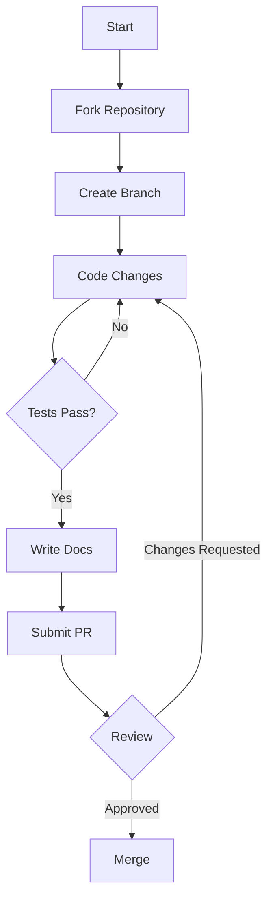

# Contributing to Math Explorer

First off, thank you for considering contributing to Math Explorer! It's people like you that make this tool such a great resource.

## 🛠️ The "Golden Rule" of Contribution

**"Code explains HOW; Docs explain WHY."**

When you submit a PR, you aren't just merging code; you are merging knowledge. Ensure your contributions are accessible to others.

## 🚀 Getting Started

1.  **Fork the repository** on GitHub.
2.  **Clone your fork** locally:
    ```bash
    git clone https://github.com/fderuiter/math-explorer.git
    cd math-explorer
    ```
3.  **Create a branch** for your feature or fix:
    ```bash
    git checkout -b feature/amazing-new-math
    ```

## 🔄 Workflow



## 🧪 Testing

We take reliability seriously. Before submitting, ensure all tests pass.

```bash
# Run tests for the core library
cargo test --package math_explorer

# Run checks for the GUI (if applicable)
cargo check --package math_explorer_gui
```

If you add new functionality, **you must add tests**.
- **Unit Tests**: Place them in the same file as the code, in a `mod tests` module.
- **Integration Tests**: Place them in the `tests/` directory.

## 🖥️ Contributing to the GUI

The `math_explorer_gui` crate is built with **egui** and **eframe**.

*   **Roadmap:** Please consult [todo_gui.md](todo_gui.md) before starting a new GUI feature to ensure alignment with the project goals.
*   **Structure:**
    *   UI code resides in `math_explorer_gui/src`.
    *   The GUI should primarily visualize and control logic defined in the core `math_explorer` library. Avoid implementing heavy mathematical logic directly in the GUI crate.
*   **Dependencies:** We maintain strict version compatibility between `egui`, `eframe`, and `egui_plot`. Check `Cargo.toml` before updating dependencies.

## 📝 Documentation Style Guide

We follow the **Curator's Philosophy**:

*   **Public API**: Every public struct, enum, and function must have a docstring (`///`).
*   **Examples**: Include runnable examples in your docstrings using generic code blocks or doctests.
*   **Clarity**: Avoid fluff words ("simple", "easy"). Be precise.

Example:

```rust
/// Checks if a number is a prime number.
///
/// # Arguments
///
/// * `n` - The number to check.
///
/// # Returns
///
/// `true` if `n` is prime, `false` otherwise.
///
/// # Example
///
/// ```
/// use math_explorer::pure_math::number_theory::is_prime;
/// assert!(is_prime(5));
/// assert!(!is_prime(4));
/// ```
pub fn is_prime(n: u64) -> bool { ... }
```

## 📦 Submission Process

1.  **Commit your changes** with a descriptive message.
2.  **Push to your branch**.
3.  **Open a Pull Request**.
4.  **Wait for review**. We might ask for changes to code or documentation.

Thank you for helping us fight Knowledge Rot! 📜
