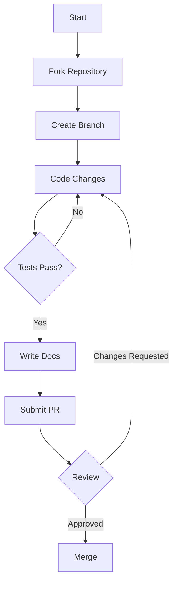

# Contributing to Math Explorer

First off, thank you for considering contributing to Math Explorer! It's people like you that make this tool such a great resource.

## 🛠️ The "Golden Rule" of Contribution

**"Code explains HOW; Docs explain WHY."**

When you submit a PR, you aren't just merging code; you are merging knowledge. Ensure your contributions are accessible to others.

## 🚀 Getting Started

1.  **Fork the repository** on GitHub.
2.  **Clone your fork** locally:
    ```bash
    git clone https://github.com/fderuiter/math-explorer.git
    cd math-explorer
    ```
3.  **Create a branch** for your feature or fix:
    ```bash
    git checkout -b feature/amazing-new-math
    ```

## 💻 Local Development

To ensure your code meets our standards before submitting, we use [pre-commit](https://pre-commit.com/).

1.  **Install pre-commit**:
    ```bash
    pip install pre-commit
    ```
2.  **Install the git hooks**:
    ```bash
    pre-commit install
    ```

Now, every time you commit, it will automatically run formatting and linting checks.

## 🔄 Workflow



## 🧪 Testing

We take reliability seriously. Before submitting, ensure all tests pass.

```bash
cd math_explorer
cargo test
```

If you add new functionality, **you must add tests**.
- **Unit Tests**: Place them in the same file as the code, in a `mod tests` module.
- **Integration Tests**: Place them in the `tests/` directory.

## 📝 Documentation Style Guide

We follow the **Curator's Philosophy**:

*   **Public API**: Every public struct, enum, and function must have a docstring (`///`).
*   **Examples**: Include runnable examples in your docstrings using generic code blocks or doctests.
*   **Clarity**: Avoid fluff words ("simple", "easy"). Be precise.

Example:

```rust
/// Calculates the area of a circle.
///
/// # Arguments
///
/// * `radius` - The radius of the circle in meters.
///
/// # Returns
///
/// The area in square meters.
///
/// # Example
///
/// ```
/// use math_explorer::geometry::area_circle;
/// let area = area_circle(2.0);
/// ```
pub fn area_circle(radius: f64) -> f64 { ... }
```

## 📦 Submission Process

1.  **Commit your changes** with a descriptive message.
2.  **Push to your branch**.
3.  **Open a Pull Request**.
4.  **Wait for review**. We might ask for changes to code or documentation.

Thank you for helping us fight Knowledge Rot! 📜

## 🛡️ Security

If you discover a security vulnerability, please refer to our [Security Policy](SECURITY.md) for reporting instructions.
