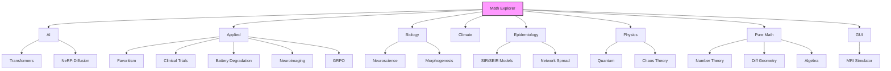
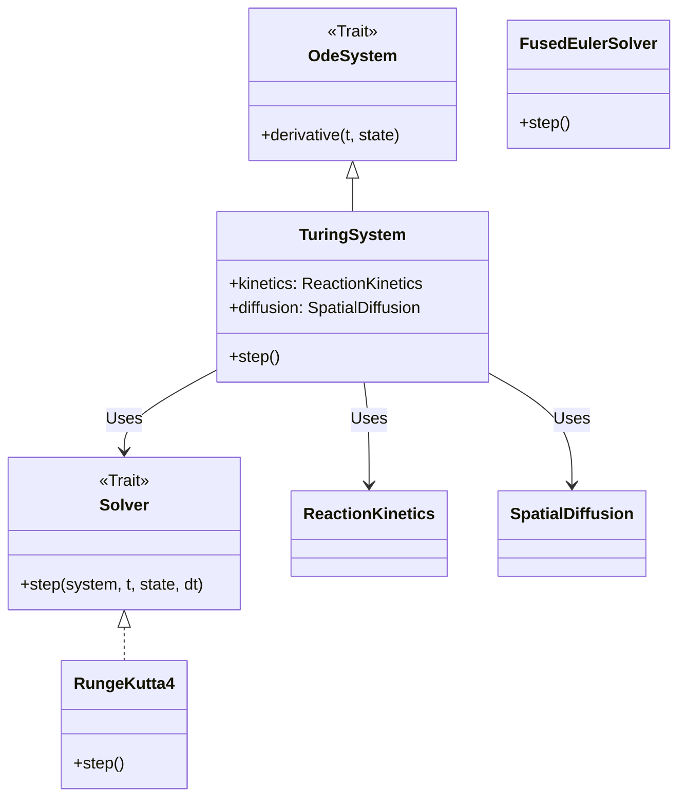

# Math Explorer


**Math Explorer** is a comprehensive Rust library that bridges the gap between rigorous academic theory and executable code. From simulating Quantum Mechanics to modeling Social Favoritism, this repository serves as a verifiable playground for complex algorithms.

> **"Code explains HOW; Docs explain WHY."**

---

## Install

```bash
git clone https://github.com/fderuiter/math-explorer.git
cd math-explorer

# Check prerequisites, build the core library, and run tests
# Note: To compile academic papers, ensure pdflatex (e.g., via TeX Live) is installed.
./setup.sh
```

Alternatively, you can manually build the library using Cargo:

```bash
# Build the core library manually
cargo build --release --package math_explorer
```

## Usage

### 1. The Interactive GUI (Recommended)
We provide a native eframe/egui application to explore simulations (Physics, Biology, Chaos Theory, etc.) interactively.

> **See the [Math Explorer GUI Documentation](math_explorer_gui/README.md) for architecture details and contribution guides.**

```bash
cargo run --release --package math_explorer_gui
```

### 2. Command Line "Hello World"
Experience the library in action by running our pre-built Quantum Mechanics example:

```bash
cargo run --package math_explorer --example hello_world
```

This will calculate Clebsch-Gordan coefficients with a stylized terminal output. *(See `math_explorer/examples/hello_world.rs` for implementation details)*

Alternatively, you can use the API directly in your own code:

```rust
use math_explorer::physics::quantum::clebsch_gordan;

fn main() {
    // Coupling j1=1.5, m1=-0.5 with j2=1.0, m2=1.0 to J=2.5, M=0.5
    let coeff = clebsch_gordan(1.5, -0.5, 1.0, 1.0, 2.5, 0.5);
    println!("Clebsch-Gordan Coefficient: {:.4}", coeff);
}
```

#### Current Capabilities
*   **Physics / MRI:** Bloch Simulator with real-time control over $T_1$, $T_2$, $\vec{B}$-field, and magnetization vectors.
*   **Physics / Fluid Dynamics:** Potential Flow visualization, Turbulence/Reynolds Number analysis, and interactive Lattice Boltzmann (LBM) flow simulation.
*   **Physics / Medical:** Dose Calculation (2D Heatmap of radiation dose distribution).
*   **Physics / Chaos:** Attractor Plotter (Lorenz, Rossler), Bifurcation Diagrams, and Fractal Generator.
*   **Physics / Quantum:** Schrödinger Solver, Wavefunction Evolution, and Clebsch-Gordan Calculator.
*   **Physics / Solid State:** Crystal Lattice Viewer (FCC, BCC, SC).

*See [todo_gui.md](todo_gui.md) for the development roadmap.*

### Deep Dive: Modules

The modules are organized into high-level domains, each solving specific problems:



| Domain | Module | Description |
| :--- | :--- | :--- |
| ** AI** | `math_explorer::ai` | Transformers (Attention, Encoders), **Reinforcement Learning** (Q-Learning), NeRF-Diffusion (SDS), and Self-Calibration loops. |
| ** Applied** | `math_explorer::applied` | **Favoritism** (Satirical modeling), **Clinical Trials** (Win Ratio), **Battery Degradation** (Li-ion), **Isosurface** (Marching Cubes), **LoraHub**, **Neuroimaging**, and **GRPO** (Policy Optimization). |
| ** Biology** | `math_explorer::biology` | **Neuroscience** (Hodgkin-Huxley), **Morphogenesis** (Turing Patterns), **Generic Reaction-Diffusion**, and **Evolutionary Dynamics**. |
| ** Climate** | `math_explorer::climate` | **CERA Framework** (Climate-invariant Encoding through Representation Alignment). |
| ** Epidemiology** | `math_explorer::epidemiology` | **Compartmental Models** (SIR/SEIR), **Network Spread**, and **Stochastic Dynamics**. |
| ** Physics** | `math_explorer::physics` | Quantum Mechanics (Clebsch-Gordan), Astrophysics, Chaos Theory (Lorenz System), and Fluid Dynamics. |
| ** Pure Math** | `math_explorer::pure_math` | **FRACTRAN** (Algorithmic Info), **Statistics** (Glicko-2, Markov, TDA), **Tensors** (Christoffel Symbols), Number Theory, Graph Theory, and **Abstract Algebra**. |
| ** GUI** | `math_explorer_gui` | Interactive **eframe/egui** application for visualizing simulations (currently MRI Physics). |

To maintain flexibility and testability across domains, Math Explorer relies heavily on the Strategy Pattern. This allows users to swap numerical solvers, diffusion models, or reaction kinetics without changing the core system logic.



### 3. Comprehensive Examples

Explore 20+ specialized, runnable examples spanning Physics, AI, Biology, and Pure Math.

> **See the [Examples Catalog](math_explorer/examples/README.md) for the full list of simulations and their commands.**

---

## Config

Some modules are intentionally excluded from the default compilation to reduce build times or avoid heavy external dependencies (like LibTorch). These are called "Ghost Modules."

### Generative Turbulence
A deep learning-based module for generating turbulent flow fields using `tch-rs`. It is excluded by default because it requires a local LibTorch installation.

To learn how to enable it and explore the code, see the [Generative Turbulence Documentation](math_explorer/src/applied/generative_turbulence/README.md).

---

## Contributing

We welcome contributions! Please see [CONTRIBUTING.md](CONTRIBUTING.md) for our style guide and process.

**The Golden Rule:** If you add code, you must add documentation and tests.

To verify the integrity of all mathematical implementations:

```bash
# Test the core library
cargo test --package math_explorer
```

### License

This project is open-source. See the [LICENSE](LICENSE) file for details.
