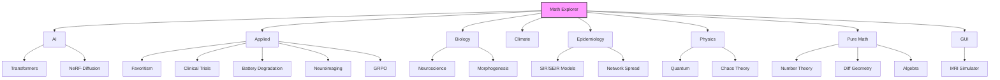
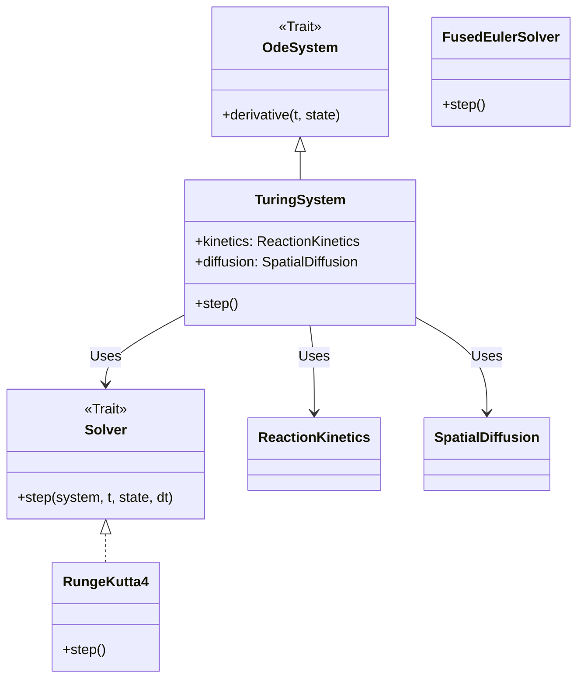

# Math Explorer


**Math Explorer** is a comprehensive Rust library that bridges the gap between rigorous academic theory and executable code. From simulating Quantum Mechanics to modeling Social Favoritism, this repository serves as a verifiable playground for complex algorithms.

> **"Code explains HOW; Docs explain WHY."**

---

## Install

Add `math_explorer` to your project (or clone the repo):

```bash
git clone https://github.com/fderuiter/math-explorer.git
cd math-explorer
# Build the library
cargo build --release --package math_explorer
# Run the GUI
cargo run --release --package math_explorer_gui
```

---

## Usage

### Run "Hello World"
Experience the library in action by running our pre-built Quantum Mechanics example:

```bash
cargo run --package math_explorer --example hello_world
```

This will calculate Clebsch-Gordan coefficients with a stylized terminal output. Alternatively, you can use the API directly in your own code:

```rust
use math_explorer::physics::quantum::clebsch_gordan;

fn main() {
    // Coupling j1=1.5, m1=-0.5 with j2=1.0, m2=1.0 to J=2.5, M=0.5
    let coeff = clebsch_gordan(1.5, -0.5, 1.0, 1.0, 2.5, 0.5);
    println!("Clebsch-Gordan Coefficient: {:.4}", coeff);
}
```

### Graphical User Interface
We provide a native GUI application to explore simulations interactively.

> **See the [Math Explorer GUI Documentation](math_explorer_gui/README.md) for architecture details and contribution guides.**

#### Launching the GUI
```bash
cargo run --release --package math_explorer_gui
```

#### Current Capabilities
*   **Physics / MRI:** Bloch Simulator with real-time control over $T_1$, $T_2$, $\vec{B}$-field, and magnetization vectors.
*   **Physics / Fluid Dynamics:** Potential Flow visualization, Turbulence/Reynolds Number analysis, and interactive Lattice Boltzmann (LBM) flow simulation.
*   **Physics / Medical:** Dose Calculation (2D Heatmap of radiation dose distribution).
*   **Physics / Chaos:** Attractor Plotter (Lorenz, Rossler), Bifurcation Diagrams, and Fractal Generator.
*   **Physics / Quantum:** Schrödinger Solver, Wavefunction Evolution, and Clebsch-Gordan Calculator.
*   **Physics / Solid State:** Crystal Lattice Viewer (FCC, BCC, SC).

*See [todo_gui.md](todo_gui.md) for the development roadmap.*

### Deep Dive: Modules

The modules are organized into high-level domains, each solving specific problems:



| Domain | Module | Description |
| :--- | :--- | :--- |
| ** AI** | `math_explorer::ai` | Transformers (Attention, Encoders), **Reinforcement Learning** (Q-Learning), NeRF-Diffusion (SDS), and Self-Calibration loops. |
| ** Applied** | `math_explorer::applied` | **Favoritism** (Satirical modeling), **Clinical Trials** (Win Ratio), **Battery Degradation** (Li-ion), **Isosurface** (Marching Cubes), **LoraHub**, **Neuroimaging**, and **GRPO** (Policy Optimization). |
| ** Biology** | `math_explorer::biology` | **Neuroscience** (Hodgkin-Huxley), **Morphogenesis** (Turing Patterns), **Generic Reaction-Diffusion**, and **Evolutionary Dynamics**. |
| ** Climate** | `math_explorer::climate` | **CERA Framework** (Climate-invariant Encoding through Representation Alignment). |
| ** Epidemiology** | `math_explorer::epidemiology` | **Compartmental Models** (SIR/SEIR), **Network Spread**, and **Stochastic Dynamics**. |
| ** Physics** | `math_explorer::physics` | Quantum Mechanics (Clebsch-Gordan), Astrophysics, Chaos Theory (Lorenz System), and Fluid Dynamics. |
| ** Pure Math** | `math_explorer::pure_math` | **Statistics** (Glicko-2, Markov, TDA), **Tensors** (Christoffel Symbols), Number Theory, Graph Theory, and **Abstract Algebra**. |
| ** GUI** | `math_explorer_gui` | Interactive **eframe/egui** application for visualizing simulations (currently MRI Physics). |

To maintain flexibility and testability across domains, Math Explorer relies heavily on the Strategy Pattern. This allows users to swap numerical solvers, diffusion models, or reaction kinetics without changing the core system logic.



#### Competitive Statistics: Glicko-2
Implement the same rating system used by professional esports leagues.

```rust
use math_explorer::pure_math::statistics::glicko2::{
    GlickoPlayer, Rating, RatingDeviation, Volatility, MatchResult, update_rating, SystemConstant
};

fn main() {
    // Player wins against a 1700-rated opponent
    let player = GlickoPlayer::default(); // 1500 rating
    let opponent = GlickoPlayer::new(
        Rating::new(1700.0).unwrap(),
        RatingDeviation::new(300.0).unwrap(),
        Volatility::default()
    );

    let result = MatchResult::new(opponent, 1.0).unwrap(); // Win
    let tau = SystemConstant::new(0.5).unwrap();

    let new_player = update_rating(&player, &[result], &tau).unwrap();
    println!("New Rating: {:.0}", new_player.rating.value());
}
```

#### Biology & Neuroscience
Simulate the electrical characteristics of excitable cells using the Hodgkin-Huxley model.

```rust
use math_explorer::biology::neuroscience::HodgkinHuxleyNeuron;

fn main() {
    // Initialize a neuron at resting potential (-65.0 mV)
    let mut neuron = HodgkinHuxleyNeuron::new(-65.0);
    let dt = 0.01; // 0.01 ms time step

    // Simulate for 10ms with 10 uA/cm^2 current injection
    for _ in 0..1000 {
        neuron.update(dt, 10.0);
        if neuron.v() > 0.0 {
            println!("Action Potential Generated!");
            break;
        }
    }
}
```

#### Artificial Intelligence
Implement state-of-the-art architectures from scratch.

**Example: Transformer Encoder**
```rust
use math_explorer::ai::transformer::Encoder;
use nalgebra::DMatrix;

fn main() {
    // Initialize an Encoder stack: 2 layers, 512 embedding dim, 8 heads, 2048 FF dim
    let encoder = Encoder::new(2, 512, 8, 2048);

    // Dummy input: Sequence length 10
    let input = DMatrix::zeros(10, 512);
    let _encoded = encoder.forward(input, None);
}
```

#### Climate Modeling: CERA Framework
Train a model to learn climate-invariant representations using the CERA architecture.

```rust
use math_explorer::climate::cera::Cera;
use math_explorer::climate::config::CeraConfig;
use math_explorer::climate::training::CeraTrainer;
use nalgebra::DMatrix;

fn main() {
    // 1. Configure the architecture
    let config = CeraConfig {
        in_channels: 2,         // e.g., Temp, Humidity
        latent_channels: 4,     // Compressed state
        aligned_channels: 2,    // Invariant state
        num_levels: 10,         // Atmospheric levels
        output_size: 5,         // Prediction target
        epochs: 1,
        batch_size: 2,
        learning_rate: 0.01,
        lambda_pred: 1.0,
        lambda_emd: 0.1,
    };

    // 2. Initialize Model & Trainer
    let mut model = Cera::new(config).expect("Invalid config");
    let mut trainer = CeraTrainer::new(&mut model);

    // 3. Train on synthetic data (Batch Size * Num Levels, Channels)
    let inputs = DMatrix::<f32>::from_fn(20, 2, |_, _| rand::random());
    let targets = DMatrix::<f32>::from_fn(2, 5, |_, _| rand::random());
    let warm_inputs = DMatrix::<f32>::from_fn(20, 2, |_, _| rand::random());

    trainer.train(&inputs, &targets, &warm_inputs);
}
```

#### Applied Mathematics: Favoritism
A mathematical model to determine who the favorite child is.

```rust
use math_explorer::applied::favoritism::{FavoritismInputs, calculate_favoritism_score};

fn main() {
    let mut inputs = FavoritismInputs::default();
    inputs.personality.wealth = 10.0;          // High wealth factor
    inputs.social.helped_during_crisis = true; // High social utility

    let score = calculate_favoritism_score(&inputs);
    println!("Favoritism Score: {}", score); // Higher is better
}
```

#### Pure Math: Abstract Algebra
Construct Finite Fields ($\mathbb{F}_p$) and perform polynomial arithmetic.

```rust
use math_explorer::pure_math::algebra::{Fp, Polynomial};

fn main() {
    // 1. Arithmetic in Finite Field F_7
    let a = Fp::<7>::new(3);
    let b = Fp::<7>::new(5);
    // (3 * 5) % 7 = 15 % 7 = 1
    assert_eq!(a * b, Fp::<7>::new(1));

    // 2. Polynomials over F_7: P(x) = 3x^2 + 5
    let _p = Polynomial::new(vec![b, Fp::<7>::new(0), a]);
}
```

#### Pure Math: Tensor Calculus
Compute Christoffel symbols for a curved manifold (e.g., a sphere).

```rust
use math_explorer::pure_math::tensor::{christoffel_symbols, RiemannianMetric};
use nalgebra::{DMatrix, DVector};

fn main() {
    // Metric for a 2D sphere (Radius = 1.0)
    let metric = RiemannianMetric::new(|p: &DVector<f64>| {
        let theta = p[0];
        let g11 = 1.0;
        let g22 = theta.sin().powi(2);
        DMatrix::from_vec(2, 2, vec![g11, 0.0, 0.0, g22])
    });

    // Compute symbols at theta = 45 degrees
    let point = DVector::from_vec(vec![std::f64::consts::FRAC_PI_4, 0.0]);
    let gammas = christoffel_symbols(&metric, &point).expect("Singular metric");

    println!("Gamma^theta_phi_phi: {:.4}", gammas[0][(1, 1)]); // -0.5000
}
```

#### Physics: Chaos Theory
Explore the Lorenz System and Lyapunov exponents.

**Example: The Butterfly Effect**
Witness the exponential divergence of two nearby trajectories.

```bash
# Run the simulation
cargo run --release --package math_explorer --example lorenz_chaos
```

*(See `math_explorer/src/physics/chaos/lorenz.rs` for implementation details)*

---

## Config

Some modules are intentionally excluded from the default compilation to reduce build times or avoid heavy external dependencies (like LibTorch). These are called "Ghost Modules."

### Generative Turbulence
A deep learning-based module for generating turbulent flow fields using `tch-rs`. It is excluded by default because it requires a local LibTorch installation.

To learn how to enable it and explore the code, see the [Generative Turbulence Documentation](math_explorer/src/applied/generative_turbulence/README.md).

---

## Contributing

We welcome contributions! Please see [CONTRIBUTING.md](CONTRIBUTING.md) for our style guide and process.

**The Golden Rule:** If you add code, you must add documentation and tests.

To verify the integrity of all mathematical implementations:

```bash
# Test the core library
cargo test --package math_explorer
```

### License

This project is open-source. See the [LICENSE](LICENSE) file for details.
