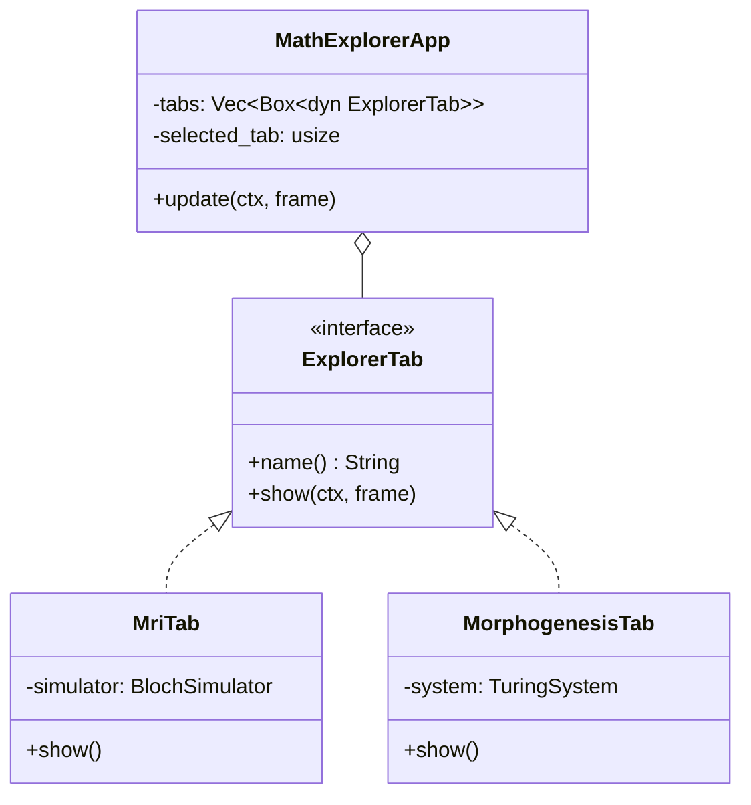

# Math Explorer GUI

The graphical front-end for the `math_explorer` library, built using `eframe` (egui framework).


##  Quickstart

To run the application:

```bash
cargo run --release --package math_explorer_gui
```

##  Architecture

The GUI follows a modular architecture based on the `ExplorerTab` trait. The main application `MathExplorerApp` manages a list of these tabs and handles navigation.



### Key Components

*   **`MathExplorerApp`**: The root component implementing `eframe::App`. It renders the top navigation bar and delegates the main content area to the active tab.
*   **`ExplorerTab`**: The trait that all visualization modules must implement. It provides a standard interface for the app to interact with different simulations.
*   **`math_explorer` Dependency**: All heavy mathematical logic (physics, biology, etc.) resides in the core `math_explorer` crate. The GUI crate should focus **only** on visualization and input handling.

##  Contributing: Adding a New Tab

Follow these steps to add a new visualization module (e.g., for `fluid_dynamics`).

### 1. Create the Module
You can create a single file `src/tabs/fluid_dynamics.rs` or a directory `src/tabs/fluid_dynamics/mod.rs` for complex modules.

**Example `src/tabs/fluid_dynamics.rs`:**

```rust
use crate::tabs::ExplorerTab;
use eframe::egui;

pub struct FluidDynamicsTab {
    // State goes here
    velocity: f64,
}

impl Default for FluidDynamicsTab {
    fn default() -> Self {
        Self { velocity: 0.0 }
    }
}

impl ExplorerTab for FluidDynamicsTab {
    fn name(&self) -> &'static str {
        "Fluid Dynamics"
    }

    fn show(&mut self, ctx: &egui::Context, _frame: &mut eframe::Frame) {
        egui::CentralPanel::default().show(ctx, |ui| {
            ui.heading("Fluid Simulation");
            ui.add(egui::Slider::new(&mut self.velocity, 0.0..=100.0).text("Velocity"));
        });
    }
}
```

### 2. Register the Module
In `src/tabs/mod.rs`, add your module:

```rust
pub mod fluid_dynamics;
```

### 3. Add to App
In `src/app.rs` (or wherever the tabs are initialized, likely in `MathExplorerApp::default`), add your tab to the list:

```rust
Box::new(FluidDynamicsTab::default()),
```

##  Design Principles

1.  **Separation of Concerns**: Keep simulation logic in `math_explorer`. If you need a new simulation model, add it to the core library first, then visualize it here.
2.  **Immediate Mode**: `egui` is an immediate mode GUI. This means the `show()` function is called every frame. Avoid heavy computations directly in `show()`. Use a separate thread or perform small updates per frame.
3.  **No Heavy Dependencies**: We try to keep the GUI crate lightweight. Avoid adding heavy dependencies like `rand` if a simple internal implementation or a dependency from `math_explorer` suffices.
