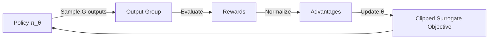

# Group Relative Policy Optimization (GRPO)


A Reinforcement Learning algorithm designed for reasoning tasks, which optimizes a policy
by evaluating a *group* of outputs for a given input, rather than a single output.

GRPO estimates the "advantage" of a response by comparing its reward to the average
reward of other responses in the same group. This reduces gradient variance without
needing a separate Value Network (Critic).

> **"Code explains HOW; Docs explain WHY."**

---

## Install

This module is part of the `math_explorer` core library. To use it, include the library in your `Cargo.toml`.

```toml
[dependencies]
math_explorer = { path = "path/to/math_explorer" }
```

---

## Usage

You can see this model in action by running the standalone, fully executable example:

```bash
cargo run --release --package math_explorer --example grpo_demo
```

*(See `math_explorer/examples/grpo_demo.rs` for implementation details)*

---

## Config

### The Optimization Loop



---

## Contributing

See the [Project Contributing Guide](../../../../CONTRIBUTING.md) for details on adding new architectures, models, or algorithms.
