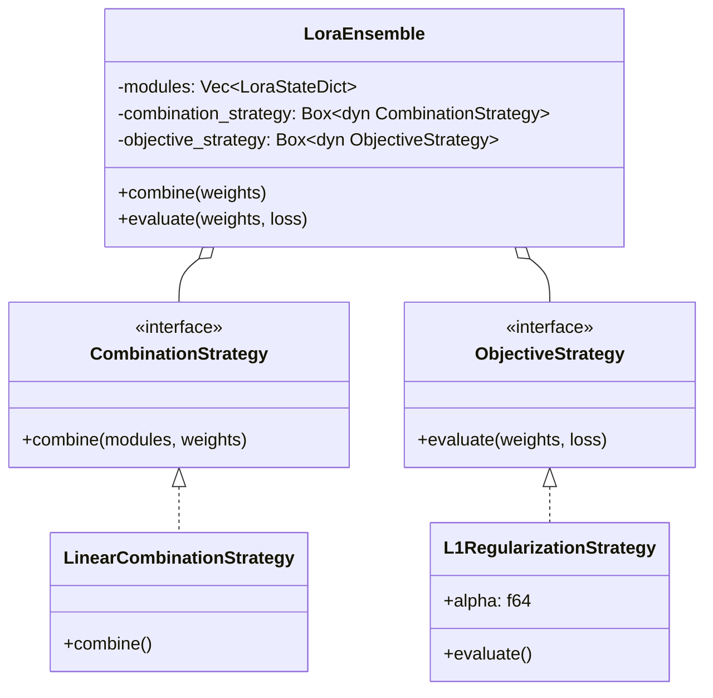

# LoraHub Mathematical Core


A modular framework for **merging Low-Rank Adaptations (LoRA)** of Large Language Models (LLMs).

LoraHub allows you to combine multiple LoRA modules trained on different tasks into a single
fine-tuned model without retraining. It uses a **Strategy Pattern** to decouple the combination
logic (how weights are mixed) from the objective evaluation (how well the mix performs).

> **"Code explains HOW; Docs explain WHY."**

---

## Install

This module is part of the `math_explorer` core library. To use it, include the library in your `Cargo.toml`.

```toml
[dependencies]
math_explorer = { path = "path/to/math_explorer" }
```

---

## Usage

You can see this model in action by running the standalone, fully executable example:

```bash
cargo run --release --package math_explorer --example bench_lorahub
```

*(See `math_explorer/examples/bench_lorahub.rs` for implementation details)*

### Quick Start: Merging LoRAs

```rust
use applied::lorahub::{LoraEnsemble, LoraStateDict};
use nalgebra::DMatrix;

// 1. Create Dummy LoRA Modules (usually loaded from disk)
let mut lora_1 = LoraStateDict::new();
lora_1.insert("layer1.weight".to_string(), DMatrix::from_element(2, 2, 1.0)); // All 1s

let mut lora_2 = LoraStateDict::new();
lora_2.insert("layer1.weight".to_string(), DMatrix::from_element(2, 2, 2.0)); // All 2s

let modules = vec![lora_1, lora_2];

// 2. Initialize Ensemble (Default: Linear Combination)
let ensemble = LoraEnsemble::new(modules);

// 3. Define weights for the mix (e.g., 0.5 of LoRA 1 + 0.5 of LoRA 2)
let weights = vec![0.5, 0.5];

// 4. Combine
let result = ensemble.combine(&weights).expect("Combination failed");

// 5. Verify: 0.5 * 1.0 + 0.5 * 2.0 = 1.5
let combined_matrix = result.get("layer1.weight").unwrap();
assert!((combined_matrix[(0, 0)] - 1.5).abs() < 1e-6);
println!("Combined Matrix Element: {:.2}", combined_matrix[(0, 0)]);
```

---

## Config

### Architecture



---

## Contributing
See the [Project Contributing Guide](../../../../CONTRIBUTING.md) for details on adding new architectures, models, or algorithms.
