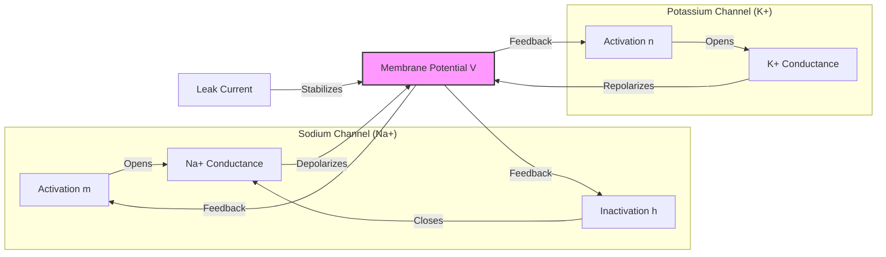
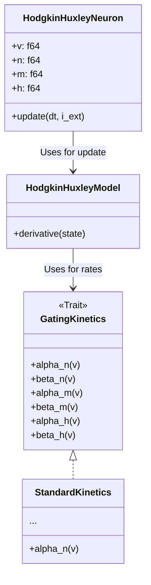

# Neuroscience (Hodgkin-Huxley)


This module implements the Hodgkin-Huxley model, a mathematical model that describes how action potentials
in neurons are initiated and propagated. It is a set of nonlinear differential equations that approximates
the electrical characteristics of excitable cells such as neurons and cardiac myocytes.

> **"Code explains HOW; Docs explain WHY."**

---

## Install

This module is part of the `math_explorer` core library. To use it, include the library in your `Cargo.toml`.

```toml
[dependencies]
math_explorer = { path = "path/to/math_explorer" }
```

---

## Usage

You can see this model in action by running the standalone, fully executable example:

```bash
cargo run --release --package math_explorer --example hodgkin_huxley_demo
```

*(See `math_explorer/examples/hodgkin_huxley_demo.rs` for implementation details)*

### Quick Start

Simulate a single neuron firing an action potential.

```rust
use domain_biology::biology::neuroscience::HodgkinHuxleyNeuron;

// 1. Initialize neuron at resting potential (-65.0 mV)
let mut neuron = HodgkinHuxleyNeuron::new(-65.0);

// 2. Simulation parameters
let dt = 0.01; // Time step (ms)
let current_injection = 10.0; // External current (uA/cm^2)
let mut spiked = false;

// 3. Run simulation loop
for _time_step in 0..1000 {
    neuron.update(dt, current_injection);

    // Check for spike (positive voltage)
    if neuron.v() > 0.0 {
        spiked = true;
        // In a real app, you might record the spike time here
    }
}

assert!(spiked, "Neuron should have generated an action potential");
println!("Final Voltage: {:.2} mV", neuron.v());
```

---

## Config

### The Model

The model treats the cell membrane as an electrical circuit with a capacitor (lipid bilayer) and
resistors (ion channels) in parallel.

The membrane potential $V$ evolves according to:

$$ C_m \frac{dV}{dt} = I_{inj} - (I_{Na} + I_{K} + I_{L}) $$

Where:
- $I_{Na} = \bar{g}_{Na} m^3 h (V - E_{Na})$: Sodium current (Depolarization).
- $I_{K} = \bar{g}_{K} n^4 (V - E_{K})$: Potassium current (Repolarization).
- $I_{L} = \bar{g}_{L} (V - E_{L})$: Leak current (Resting potential).

### Dynamics Flowchart

The gating variables ($m, h, n$) control the conductance of the channels, creating a feedback loop.



### Architecture

The implementation follows a modular design to separate the neuron state, the physics model, and the kinetics strategy.



---

## Contributing

See the [Project Contributing Guide](../../../../CONTRIBUTING.md) for details on adding new architectures, models, or algorithms.
