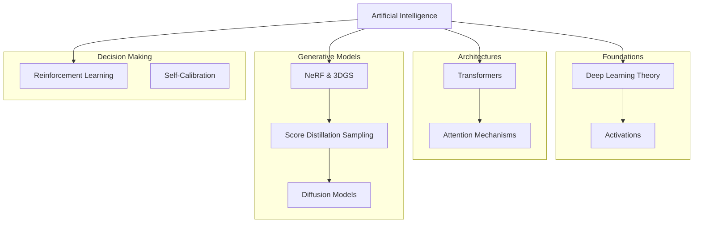

# Deep Learning & AI Module


> **"What I cannot create, I cannot understand."** — Richard Feynman

This module implements state-of-the-art Artificial Intelligence architectures **from scratch** using pure Rust and linear algebra. We avoid "black box" APIs to provide a transparent view of the mathematical machinery under the hood.

---

## Install

This module is part of the `math_explorer` core library. To use it, include the library in your `Cargo.toml`.

```toml
[dependencies]
math_explorer = { path = "path/to/math_explorer" }
```

---

## Usage

### Quick Start: Transformer Encoder

Create a standard Transformer Encoder stack to process sequential data.

```rust
use math_explorer::ai::transformer::Encoder;
use nalgebra::DMatrix;

// 1. Configure the Architecture
let num_layers = 2;
let d_model = 512;      // Embedding dimension
let num_heads = 8;      // Attention heads
let d_ff = 2048;        // Feed-forward hidden dimension

let encoder = Encoder::new(num_layers, d_model, num_heads, d_ff);

// 2. Prepare Input (Batch Size x Sequence Length x Embedding Dim)
// Note: This implementation currently handles 2D matrices (SeqLen x Dim)
let seq_len = 10;
// Create dummy data using a deterministic function
let input_data = DMatrix::<f64>::from_fn(seq_len, d_model, |r, c| (r + c) as f64 * 0.01);

// 3. Forward Pass
let output = encoder.forward(input_data, None);

println!("Output shape: ({}, {})", output.nrows(), output.ncols());
```

---

## Deep Dive (Architecture)

The AI module is organized into four foundational pillars:



---

## Config (Submodules)

### 1. `transformer`
The backbone of modern NLP. We implement:
*   **Multi-Head Attention**: Splitting the embedding space to attend to different parts of the sequence.
*   **Positional Encoding**: Injecting sequence order information via sine/cosine functions.
*   **Layer Normalization**: Stabilizing training dynamics.

### 2. `sds` (Generative AI)
We explore **Neural Radiance Fields (NeRF)** and **3D Gaussian Splatting**, optimized via **Score Distillation Sampling (SDS)**. This allows generating 3D assets from 2D text-to-image diffusion models.

### 3. `reinforcement_learning`
Agents that learn from interaction. Includes:
*   **Q-Learning**: Off-policy control.
*   **Policy Gradients**: Optimizing the policy directly.
*   **Bellman Equations**: The fundamental recursive relationship for value functions.

---

## Contributing
See the [Project Contributing Guide](../../../CONTRIBUTING.md) for details on adding new architectures or layers.
