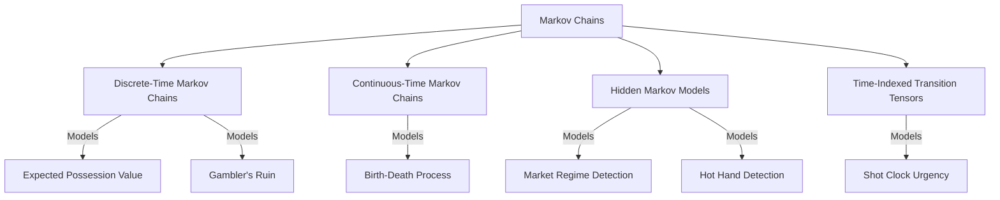

# Markov Chains Module


Comprehensive implementation of Markov processes for the `math_explorer` crate.

> **"Code explains HOW; Docs explain WHY."**

---

## Install

This module is part of the `math_explorer` core library. To use it, include the library in your `Cargo.toml`.

```toml
[dependencies]
math_explorer = { path = "path/to/math_explorer" }
```

---

## Usage

You can see all these models in action by running the standalone, fully executable example:

```bash
cargo run --release --package math_explorer --example markov_demo
```

This executable demonstrates:
1. **Expected Possession Value (DTMC with Rewards)**
2. **Shot Clock Urgency (Time-Varying Transitions)**
3. **Hot Hand Detection (HMM)**
4. **Gambler's Ruin (Classic DTMC)**
5. **Birth-Death Process (CTMC)**
6. **Market Regime Detection (HMM)**

*(See `math_explorer/examples/markov_demo.rs` for implementation details)*

---

## Config

The module is structured into the following domains, modeling transitions across discrete time, continuous time, and hidden states.



### Discrete-Time Markov Chains (DTMC)
**Why use it?** DTMCs are used when transitions happen at distinct, countable time steps (e.g., possession changes in sports, or rounds in a game). It helps calculate properties like the Expected Possession Value (EPV) or Expected Time until Absorption.

### Continuous-Time Markov Chains (CTMC)
**Why use it?** CTMCs are used when transitions can happen continuously over time (e.g., radioactive decay or birth-death processes). Transition matrices are replaced by Generator matrices where rates describe how fast states change.

### Hidden Markov Models (HMM)
**Why use it?** HMMs are critical when you cannot observe the true state of a system, but only emissions or observations generated by the hidden state (e.g., detecting market regimes from stock prices or a "hot hand" from shooting sequences). It utilizes algorithms like Viterbi (most likely sequence), Forward-Backward (smoothing), and Filtering (current belief).

### Time-Indexed Transition Tensors
**Why use it?** Standard Markov models assume homogeneous transitions (probabilities don't change over time). Tensors are used to model non-homogeneous systems, such as how basketball strategy changes as the shot clock runs out.

---

## Contributing

See the [Project Contributing Guide](../../../../../CONTRIBUTING.md) for details on adding new architectures, models, or algorithms. Run the comprehensive test suite to ensure mathematical integrity:

```bash
cargo test --lib pure_math::statistics::markov
```
