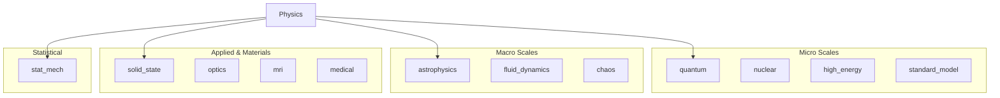

# Physics


The physics module contains implementations of physical formulas and concepts,
ranging from the quantum scale to the astrophysical scale.

> **"Code explains HOW; Docs explain WHY."**

---

## Install

This module is part of the `math_explorer` core library. To use it, include the library in your `Cargo.toml`.

```toml
[dependencies]
math_explorer = { path = "path/to/math_explorer" }
```

---

## Usage

### Quick Start: The Butterfly Effect

Simulate the Lorenz Attractor to observe deterministic chaos and the exponential divergence of nearby trajectories.

```rust
use physics::chaos::lorenz::{LorenzBuilder, LorenzState};

// 1. Initialize the system state close to the attractor
let state = LorenzState::new(10.0, 10.0, 10.0);

// 2. Build the system with standard chaotic parameters
let mut lorenz = LorenzBuilder::new()
    .sigma(10.0)
    .rho(28.0)
    .beta(8.0 / 3.0)
    .build(state);

// 3. Step forward in time (dt = 0.01)
lorenz.step(0.01);

let new_state = lorenz.state.vec;
println!("New State: ({:.2}, {:.2}, {:.2})", new_state.x, new_state.y, new_state.z);
```

---

## Config

### Architecture

The domains within physics are categorized as follows:



### Submodules
- **[astrophysics](astrophysics)**: Galaxy properties, orbital mechanics.
- **[chaos](chaos)**: Non-linear dynamics, Lorenz attractors, Lyapunov exponents.
- **[fluid_dynamics](fluid_dynamics)**: Lattice Boltzmann, potential flow.
- **[high_energy](high_energy)**: Particle physics interactions.
- **[medical](medical)**: Dose calculation and radiation modeling.
- **[mri](mri)**: Bloch simulators, spin dynamics.
- **[nuclear](nuclear)**: Liquid drop model, decays, shell model.
- **[optics](optics)**: Ray tracing, diffraction.
- **[quantum](quantum)**: Clebsch-Gordan coefficients, Schrödinger solvers.
- **[solid_state](solid_state)**: Crystal lattices, band structures.
- **[standard_model](standard_model)**: Elementary particles and interactions.
- **[stat_mech](stat_mech)**: Ising models, partition functions.

---

## Contributing

See the [Project Contributing Guide](../../../CONTRIBUTING.md) for details on adding new architectures, models, or algorithms.
