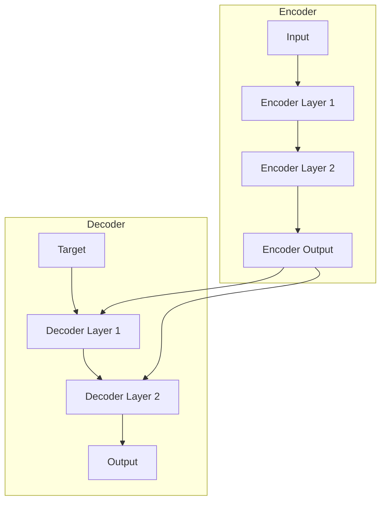

# Transformer Architecture


This module implements the Transformer architecture as described in the paper "Attention Is All You Need".

> **"Code explains HOW; Docs explain WHY."**

---

## Install

This module is part of the `math_explorer` core library. To use it, include the library in your `Cargo.toml`.

```toml
[dependencies]
math_explorer = { path = "path/to/math_explorer" }
```

---

## Usage

### Quick Start: End-to-End Example

Constructing and running a full Transformer model (Encoder + Decoder).

You can see this model in action by running the standalone, fully executable example:

```bash
cargo run --release --package math_explorer --example transformer_demo
```

*(See `math_explorer/examples/transformer_demo.rs` for implementation details)*

```rust
use math_explorer::ai::transformer::{Encoder, Decoder, Transformer};
use nalgebra::DMatrix;

// 1. Configure Model Parameters
let d_model = 64;  // Embedding dimension
let heads = 4;     // Number of attention heads
let d_ff = 128;    // Feed-forward dimension
let layers = 2;    // Number of layers

// 2. Instantiate Components
let encoder = Encoder::new(layers, d_model, heads, d_ff);
let decoder = Decoder::new(layers, d_model, heads, d_ff);

// 3. Assemble Transformer
let transformer = Transformer {
    encoder,
    decoder,
};

// 4. Create Dummy Input (Sequence Length = 10)
let seq_len = 10;
// Using constant values to simulate embeddings
let input_src = DMatrix::from_element(seq_len, d_model, 0.5);
let input_tgt = DMatrix::from_element(seq_len, d_model, 0.5);

// 5. Run Forward Pass
// A. Encoder Pass
let enc_output = transformer.encoder.forward(input_src, None);
assert_eq!(enc_output.shape(), (seq_len, d_model));

// B. Decoder Pass
// Note: In a real Seq2Seq model, you would pass the encoder output here.
let dec_output = transformer.decoder.forward(input_tgt, &enc_output, None, None);
assert_eq!(dec_output.shape(), (seq_len, d_model));
```

---

## Config

### Architecture Overview

The Transformer follows an Encoder-Decoder structure using stacked self-attention and point-wise, fully connected layers.



### Components

- **Attention**: Scaled Dot-Product Attention and Multi-Head Attention.
- **Feed Forward**: Position-wise Feed-Forward Networks.
- **Layer Norm**: Layer Normalization.
- **Encoder**: Stack of `EncoderLayer`s.
- **Decoder**: Stack of `DecoderLayer`s.

---

## Contributing

See the [Project Contributing Guide](../../../../CONTRIBUTING.md) for details on adding new architectures, models, or algorithms.
