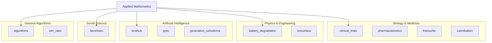

# Applied Mathematics


This module serves as a collection of mathematical models applied to specific,
often niche or complex, domains. It demonstrates how core mathematical concepts
(calculus, statistics, game theory) translate into practical solutions.

> **"Code explains HOW; Docs explain WHY."**

---

## Install

This module is part of the `math_explorer` core library. To use it, include the library in your `Cargo.toml`.

```toml
[dependencies]
math_explorer = { path = "path/to/math_explorer" }
```

---

## Usage

### Quick Start: Favoritism

A satirical yet rigorously implemented model to calculate a "Favoritism Score" for children based on wealth, social utility, and proximity.

```rust
use math_explorer::applied::favoritism::{FavoritismInputs, calculate_favoritism_score};

// 1. Configure the child's strategy
let mut inputs = FavoritismInputs::default();

// Explicitly set strategy parameters
inputs.personality.wealth = 9.5;            // High financial success
inputs.social.helped_during_crisis = true;  // Was there when needed
inputs.contact.time_since_last_contact = 2.0; // Called 2 days ago

// The "Buying Love" strategy
inputs.gifts.g_practical = 10.0; // High value gifts
inputs.gifts.g_emotional = 2.0;  // Low sentimental value

// 2. Calculate the score
let score = calculate_favoritism_score(&inputs);

println!("Your Favoritism Score: {:.2}", score);
```

---

## Config

### Architecture

The domains within applied mathematics are categorized as follows:



### Submodules

- **[algorithms](algorithms)**: General purpose algorithms, including Sorting and other utility structures.
- **[battery_degradation](battery_degradation)**: Modeling of battery health and capacity fade over time.
- **[cannibalism](cannibalism)**: Population dynamics models focusing on intraspecific predation (Cannibalism). Includes McKendrick-von Foerster equations.
- **[clinical_trials](clinical_trials)**: Statistical design and analysis for clinical trials, including sample size calculation and survival analysis.
- **[engineering](engineering)**: Common engineering formulas and models.
- **[favoritism](favoritism)**: A satirical yet rigorously implemented model to calculate a "Favoritism Score" for children based on wealth, social utility, and proximity.
- **[freesurfer](freesurfer)**: Neuroimaging pipeline for **Cortical Reconstruction**, including surface extraction, thickness measurement, and GLM statistics.
- **[game_theory](game_theory)**: Applied Game Theory, including Mean Field Games and Evolutionary Dynamics.
- **[grpo](grpo)**: Group Relative Policy Optimization (GRPO) for reasoning tasks.
- **[isosurface](isosurface)**: Algorithms for extracting surfaces from volumetric data, such as Marching Cubes.
- **[lorahub](lorahub)**: Logic for merging Low-Rank Adaptation (LoRA) weights for Large Language Models (LLMs), including ensemble composition.
- **[pharmacokinetics](pharmacokinetics)**: Modeling of drug absorption, distribution, metabolism, and excretion (ADME) using Bateman functions and multi-dose superposition.
- **[win_ratio](win_ratio)**: Statistical methods for comparing outcomes using the Win Ratio approach, common in clinical trials with composite endpoints.

*Note: [generative_turbulence](generative_turbulence) is a "Ghost Module" that is disabled by default due to heavy ML dependencies.*

---

## Contributing

See the [Project Contributing Guide](../../../CONTRIBUTING.md) for details on adding new architectures, models, or algorithms.
