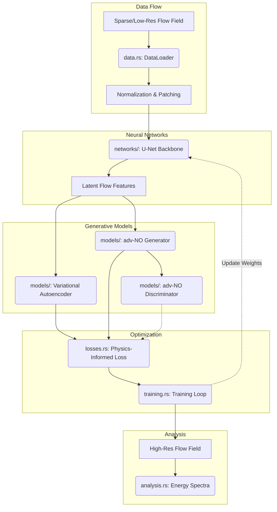

# Generative Turbulence (Ghost Module)

> **Status:**  Excluded from compilation.

## Why is this hidden?

This module implements deep learning-based turbulence generation using `tch-rs` (LibTorch bindings).

**The Problem:** `tch-rs` requires a local installation of LibTorch (the C++ PyTorch backend) and can significantly increase build times and binary sizes. Including it by default would break the "30-Second Rule" for users who just want to run pure math simulations without setting up a deep learning environment.

## How to Enable

If you want to experiment with generative turbulence models:

1.  **Install LibTorch:**
    Follow the [tch-rs installation guide](https://github.com/LaurentMazare/tch-rs) to install LibTorch and set the `LIBTORCH` environment variable.

2.  **Add Dependency:**
    Add `tch` to your `Cargo.toml`:
    ```toml
    [dependencies]
    tch = "0.15.0" # Check for latest version
    ```

3.  **Uncomment the Module:**
    In `math_explorer/src/applied/mod.rs`, uncomment the line:
    ```rust
    // pub mod generative_turbulence;
    ```

## Architecture & Flow

The overarching purpose of this module is to map low-resolution or sparse fluid data into high-fidelity representations (e.g., Super-resolution).



### Module Responsibilities

*   **`data.rs`**: Feeds turbulent flow snapshots into the system, handling batching and normalizations.
*   **`networks/`**: Provides the structural backbone (like Convolutional U-Nets) used to extract multi-scale spatial features from the fluids.
*   **`models/`**: Implements the actual generative logic (e.g., adv-NO, Diffusion Models, VAEs) combining network backbones into a coherent pipeline.
*   **`losses.rs`**: Contains domain-specific loss functions. Standard MSE is often insufficient for turbulence; physics-informed constraints (like divergence-free fields or spectral matching) are enforced here.
*   **`training.rs`**: The coordination loop that pushes data through the models, calculates loss, and steps the optimizers.
*   **`analysis.rs`**: Validates the physical correctness of the generated flows by analyzing energy spectra and velocity correlation functions.
